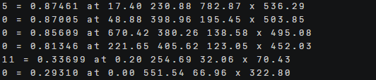
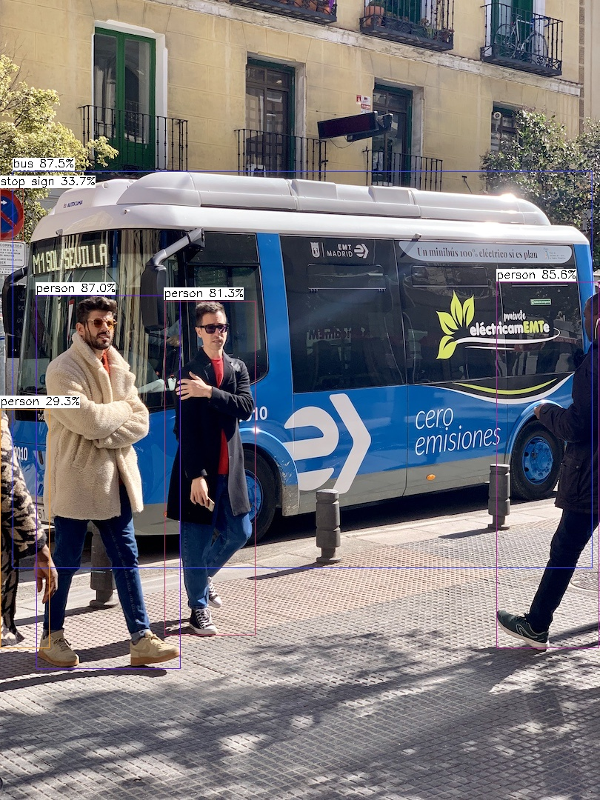
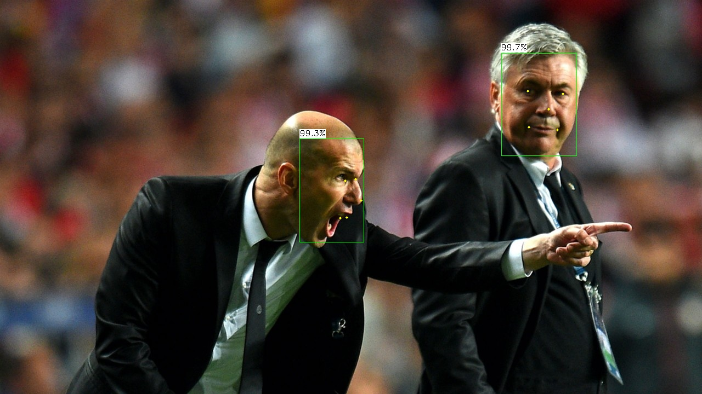

# NCNN部署指南


## ‌一、环境准备


### 更新系统


#### EulerOS2.0


```
yum -y update  
yum -y upgrade
```


#### Ubuntu 24.04


```
apt-get -y update
export DEBIAN_FRONTEND=noninteractive
apt-get -y -o Dpkg::Options::="--force-confold" dist-upgrade
```


## **二、安装conda**


```
mkdir -p ~/miniconda3

wget https://repo.anaconda.com/miniconda/Miniconda3-latest-Linux-aarch64.sh -O ~/miniconda3/miniconda.sh

bash ~/miniconda3/miniconda.sh -b -u -p ~/miniconda3

rm -f ~/miniconda3/miniconda.sh

source ~/miniconda3/bin/activate

conda init --all
```


创建虚拟环境

```
conda create -n ncnn python=3.10
```

## **三、源码下载**

### **1.下载ncnn的源码**

```
git clone https://github.com/Tencent/ncnn.git

安装依赖：

cd ncnn

git submodule update --init 安装依赖的第三方库。

sudo yum makecache sudo yum install -y gcc-c++ cmake protobuf-devel opencv-devel

sudo yum install -y cmake

编译opencv

git clone https://github.com/opencv/opencv.git

git clone https://github.com/opencv/opencv_contrib.git

cd opencv

mkdir build 

cd build

cmake -D CMAKE_BUILD_TYPE=RELEASE -D CMAKE_INSTALL_PREFIX=/usr/local -D OPENCV_EXTRA_MODULES_PATH=../../opencv_contrib/modules -D OPENCV_ENABLE_NONFREE=ON ..

编译

make  sudo make install

编译ncnn

cd build 

cmake .. -DNCNN_BENCHMARK=ON -DNCNN_VULKAN=OFF -DNCNN_BUILD_TOOLS=OFF -DNCNN_BUILD_EXAMPLES=ON

make

make install
```

 

### **2.下载对应的模型**

模型下载地址为：https://github.com/nihui/ncnn-assets/tree/master/models

如果要进行yolov8的推理，则需要下载yolov8n.ncnn.bin，yolov8n.ncnn.param两个文件。

scrfd人脸检测推理需要使用的是scrfd_500m-opt2.bin和scrfd_500m-opt2.param。retinaface推理需要使用的是mnet.25-opt.bin和mnet.25-opt.param。

检测图片下载官方的bus.jpg和zidane.jpg，然后将权重文件和图片分别上传。权重文件需要上传到./ncnn/build/examples下面，图片上传到./ncnn/images中。

 

## **四、启动项目**

### **1.修改代码**

官方代码需要使用到opencv的gui功能，这里为了能够看到推理效果，不需要使用gui功能，所以对yolov8、scrfd、retinaface对应的cpp文件进行修改。

具体修改为：

将cv::imshow("image", image);和cv::waitKey(0);注释掉，然后加入cv::imwrite("yolov8_res.jpg", image);

### **2.推理**

因为之前已经对ncnn进行了编译，但是后续对代码进行了修改，所以在进行推理之前，需要重新编译。

```
cd ./ncnn/build/examples

make clean 清理之前编译内容

make 重新编译
```

之后就能运行推理了，进行yolov8、scrfd、retinaface的推理命令是

 yolov8推理：

```
./yolov8 /home/ncnn/images/bus.jpg 
```

推理结果为：

 

 

 scrfd推理：人脸检测

```
./scrfd /home/ncnn/images/zidane.jpg 
```

推理结果为：

 

 retinaface推理：人脸检测+人脸关键点信息

```
./retinaface /home/ncnn/images/zidane.jpg  
```

推理结果为：

 
