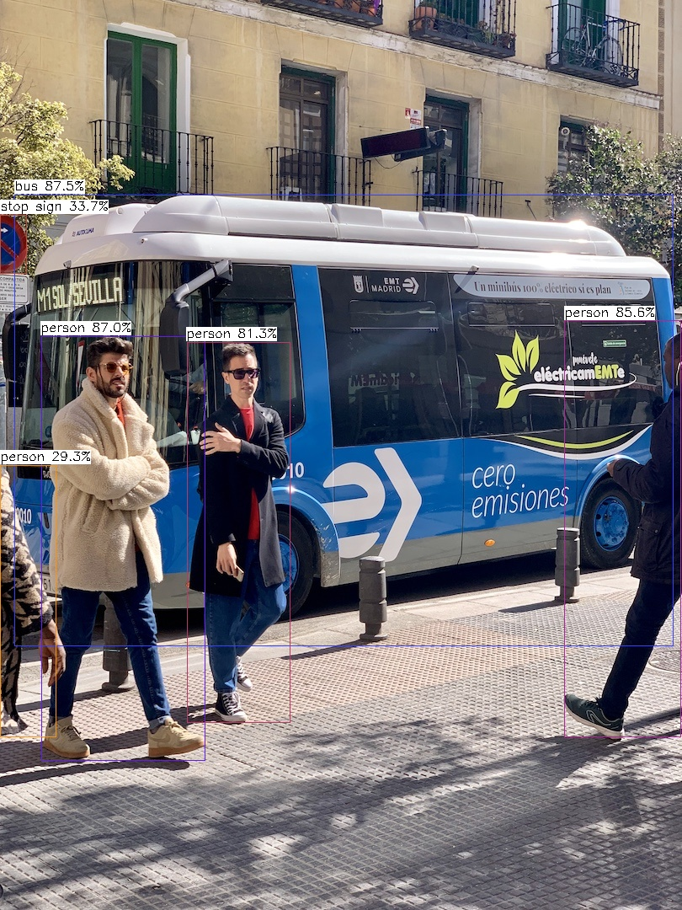

# NCNN轻量级AI视觉推理引擎使用指南


# 一、商品链接


[NCNN轻量级AI视觉推理引擎](https://marketplace.huaweicloud.com/hidden/contents/21eb05f2-1179-4ecf-a08f-b919782962af#productid=OFFI1144193128288825344)

# 二、商品说明


NCNN是基于高性能轻量级推理框架的AI视觉推理加速工具包。已集成主流人脸检测模型SCRFD和RetinaFace,以及目标检测YOLOv8等。本商品通过鲲鹏服务器+EulerOS2.0进行安装部署。

# 三、商品购买


您可以在云商店搜索 **NCNN轻量级AI视觉推理引擎**。

其中，地域、规格、推荐配置使用默认，购买方式根据您的需求选择按需/按月/按年，短期使用推荐按需，长期使用推荐按月/按年，确认配置后点击“立即购买”。

## 3.1 使用 RFS 模板直接部署


 
必填项填写后，点击 下一步


创建直接计划后，点击 确定


点击部署，执行计划

如下图“Apply required resource success. ”即为资源创建完成


# 3.2ECS 控制台配置


### 准备工作


在使用ECS控制台配置前，需要您提前配置好 **安全组规则**。

> **安全组规则的配置如下：**
>
> - 入方向规则放通 CloudShell 连接实例使用的端口 `22`，以便在控制台登录调试
> - 出方向规则一键放通

### 创建ECS


前提工作准备好后，选择 ECS 控制台配置跳转到[购买ECS](https://support.huaweicloud.com/qs-ecs/ecs_01_0103.html) 页面，ECS 资源的配置如下图所示：

选择CPU架构 

选择服务器规格 
选择镜像 
其他参数根据实际请客进行填写，填写完成之后，点击立即购买即可 


> **值得注意的是：**
>
> - VPC 您可以自行创建
> - 安全组选择 [**准备工作**](#准备工作) 中配置的安全组；
> - 弹性公网IP选择现在购买，推荐选择“按流量计费”，带宽大小可设置为5Mbit/s；
> - 高级配置需要在高级选项支持注入自定义数据，所以登录凭证不能选择“密码”，选择创建后设置；
> - 其余默认或按规则填写即可。

# 商品使用


## NCNN使用

1.准备检测图片

YOLOv8是目标检测，主要检测人、车等；SCRFD是人脸检测主要需要的是人脸图片；RetinaFace是人脸检测+关键点信息。根据自己需要上传检测图片，需要上传到/home/ncnn/images下面。

2.运行推理

（1）如果想要进行其他的推理，只需要进行几步操作即可：
```
conda activate ncnn  

cd /home/ncnn/examples

https://github.com/nihui/ncnn-assets/tree/master/models 中下载对应的权重上传到此路径下。
```
接着修改代码 vim yolov7.cpp 

将cv::imshow("image", image);和cv::waitKey(0);注释掉，然后加入cv::imwrite("result.jpg", image);

（2）运行推理
```
cd /home/ncnn/build/examples 

./yolov8  /home/ncnn/images/bus.jpg   运行推理（替换为上传的检测图片名称）
```
运行之后就能获得推理结果，推理结果为/home/ncnn/build/examples 路径下的yolov8_res.jpg，自行下载图片查看结果。





### 参考文档


[NCNN官方文档](https://github.com/Tencent/ncnn)
